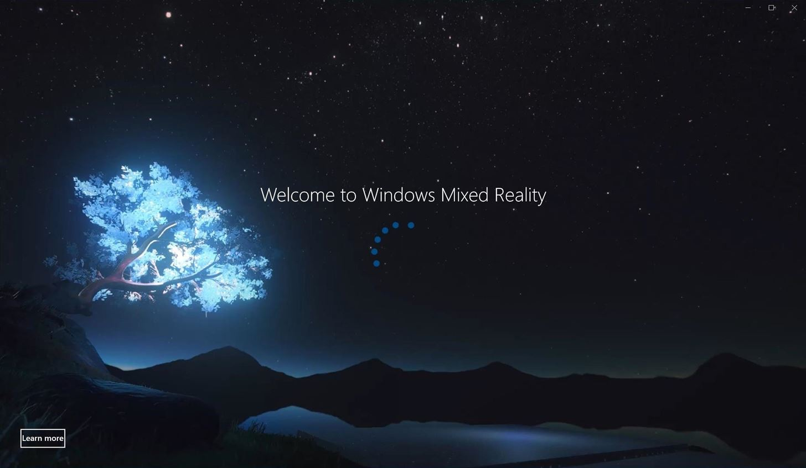
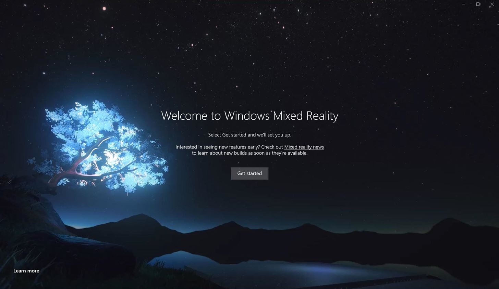
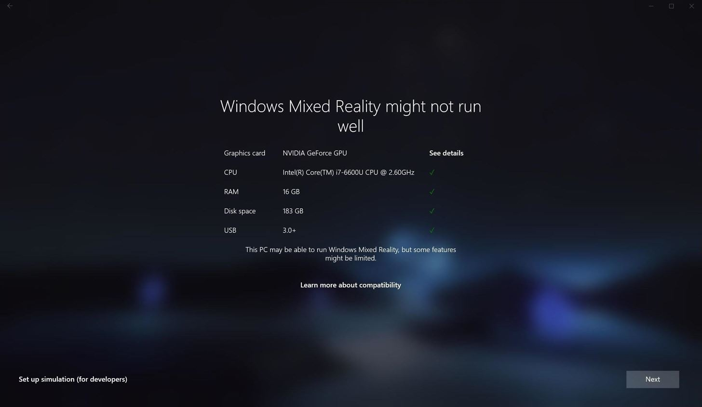
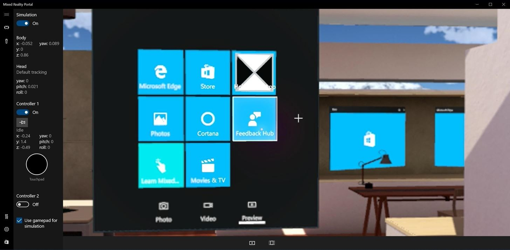
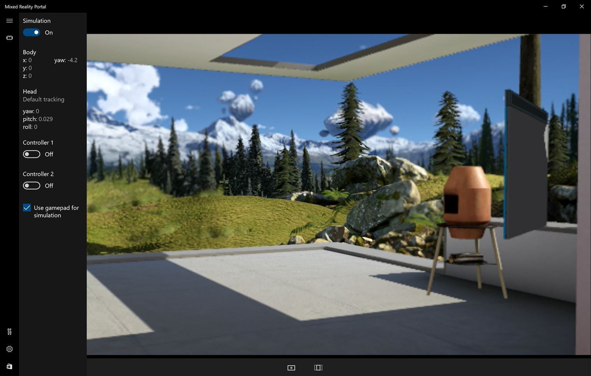

# 윈도우 혼합 현실 시뮬레이터 사용하기(Using the Windows Mixed Reality simulator)

#### Mixed Reality Simulator는 Hololens Emulator와 다르게 Hyper-V를 사용하지 않고 동작한다. (내 Surface pro 3는 Hyper-V 땜시 배터리 엄청 소모....)

* [MS에서 제공하는 설치 사이트](https://developer.microsoft.com/en-us/windows/mixed-reality/using_the_windows_mixed_reality_simulator)
  
> 아주 자세한 부분은 위의 사이트에서 확인하시고 지금부터 설명은 제가 설치한 History를 설명.
 

## 1. Windows 10 Creators Update 하기 (64bit 필수!)
> 왜 Windows 10 Creators를 설치해야 하는가는 당연히 이눔이 지원하기 때문임.  
내가 설치하는 현 시점은 자동 업데이트가 되지 않음

 * [Download URL](https://support.microsoft.com/ko-kr/instantanswers/d4efb316-79f0-1aa1-9ef3-dcada78f3fa0/get-the-windows-10-creators-update)
	- 업데이트 시작하기 전에 우선 현재 OS를 최신 업데이트 상태로 하면 좋다.
	- 해당 URL에서 Windows 10 버전 확인 절차를 따라 하면 'Windows 10 업그레이드 도우미(Windows10UpgraderApp.exe)'를 다운받을 수 있다.
		* **정확하진 않지만 내가 확인한 바로는 정품인증이 안돼어 있으면 Windows 10 Creators로 업데이트가 안될것이다.**
		* **꼭 각종 보안 서비스는 정지 시켜라. Update가 멈추는 현상이있다.**
		
	- 다운로드 파일을 실행시켜 Windows 10 Creators로 업데이트하면 된다.
		> 난 실행시켜 놓고 출근했더니 설치가 되어 있었다.
	- 업데이트가 완료한 상태에서 로그인하면 영문으로 나온다(난 그랬다). 각종 셋팅은 Korea로 되어있는데 영문으로 나온다.
		* **우선 설정->지역 및 언어->언어에서 기존의 한국어를 삭제한다**
		* **한국어가 기본값으로 설정되어있으면 삭제가 되지 않으므로 다른 언어를 기본값으로 한뒤에 삭제한다.**
		* **언어 추가->한국어를 다시 선택한뒤 클릭-> 옵션을 선택하여 Language pack을 업데이트 한다.**
		* **업데이트한뒤 다시 한국어를 기본값으로 설정한다. 그리고 컴퓨터를 다시 시작.**
		* **만약 그래도 한국어로 안나오면 제어판->언어->한국어의 옵션->Windows 표시언어 사용으로 변경 후 컴퓨터 다시시작**
		* 위의 방법을 사용하면 한국어가 표시될 것이다. (물론 설명은 한국어로 했지만.. 화면은 영문으로 나오니 잘 선택하길.)  
 

## 2. 개발자 모두 활성화(Enable Developer Mode)
- 설정 -> 업데이트 및 복구 -> 개발자용 -> 개발자 모두 선택
 

## 3. Mixed Reality Portal
	1. 윈도우 검색 창에(상태표시줄의 돋보기 아이콘 클릭) 'Mixed Reality Portal' 입력하면
	2. Windows app store에서 찾아주니 선택하면 됨.(당연히 인터넷이 연결되어 있어야 함.)

> Get Started 선택

> I agree 선택

> 자신의 컴퓨터 사양이 표시됨(See details를 클릭하면 MS 사이트로...)
  자신이 Hololens 장비가 있으면 Next선택
  없으면 왼쪽 아래의 (Set up simulation (for developers)) 선택
  

> 전진(W), 후진(S), 왼쪽(A), 오른쪽(D) 키를 누르면 화면이 움직인다.  
  시야의 위, 아래, 왼쪽, 오른쪽은 키보드의 이동키를 이용하면 된다.  
  또는 마우스 왼쪽 클릭 드래그를 이용할 수도 있다.  
  선택은 오른쪽 마우스 클릭을 하면된다.  
  [자세한정보](https://developer.microsoft.com/en-us/windows/mixed-reality/advanced_hololens_emulator_and_mixed_reality_simulator_input)
  
 

### 이로서 설치는 완료된 것이다..
