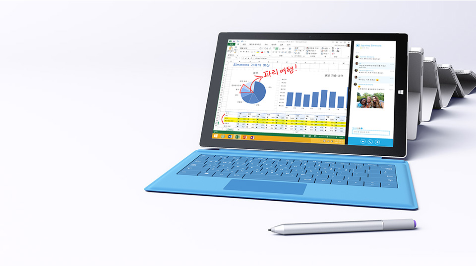
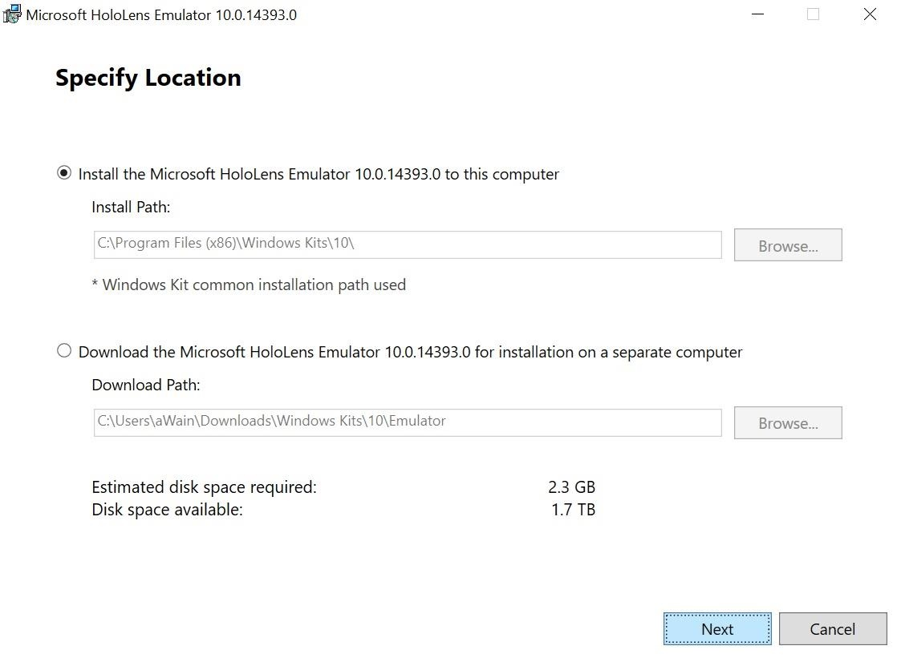

# 나의 개발 환경  

## 개발PC (Surface Pro 3) - 내꺼
 
	
### 1. Windows 10 Pro (Hyper-V)
   * [윈도우 설치 방법](https://www.microsoft.com/ko-kr/software-download/windows10)
   * Pro를 다운로드 받는 방법은 (64비트, 32비트 선택시에 모두를 선택하면 됨)
  
### 2. Hololens Emulator
   * [홀로렌즈 다운로드](http://go.microsoft.com/fwlink/?LinkID=823018)
   
   	1. 다운로드 받은 파일을 실행시키면
	
	> 위 그림과 같이 설치 방법을 선택하라고 나오고 알맞게 선택하고 Next 선택. (난 당연히 바로 설치인 첫 항목 선택)
	
	2. MS에 정보제공 선택후 Next 클릭 (난 NO 선택)
	
	
	3. 라이센스 관련 동의 Accept 선택 버튼 클릭
        
	
	4. 인스톨 항목 선택 당연히 모두 선택하고 Install 버튼 클릭
        
	
	5. 설치완료 화면 Close 선택
        
	
	
### 3. Visual Studio 2017

### 4. Unity 5.6.1

### 5. Vuforia 6.2(For Unity)
  
  
