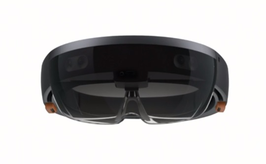

# 홀로렌즈 앱 개발

> 예전부터 홀로렌즈에 관심이 많았지만 회사생활(먹고살기 위해서...)을 핑계삼아..말 뿐이였지만.
큰 마음을 먹고 이제 공부를 해볼생각이다.
누구가를 위한것이 아니여서 맘대로 끄적거릴 생각.

## 홀로렌즈란
* MS에서 개발중인 증강현실 기기 (더 많은 정보는 링크 참조)
  * MS의 홀로렌즈 사이트 <https://www.microsoft.com/en-us/hololens>
  

## 홀로렌즈 개발환경 
#### MS 사이트 내용 요약 (https://developer.microsoft.com/en-us/windows/mixed-reality/install_the_tools)
1. Windows 10 OS 추천 - Windows 8.1, 8, 7, Windows Server 2012, Windows Server 2008 R2 (지원한다함.)
2. Visual Studio 2015 Update3 (Community, Pro, Ent)이상
	* 나는 Visual Studio 2017 Community를 설치했음.
	* 하지만 Visual Studio 2015 Update 3에서 Hololens 프로젝트 템플릿을 지원한다함. (2017은 지원안함..내가 설치하는 시점까지는..)
3. Holelens Emulator 설치
	* Hyper-V가 설치되어 있어야함(Windows Home은 Hyper-V 지원안함, Pro 이상 지원)
4. Unity 설치
5. Vuforia 설치

#### - [나의 개발 환경 및 설명](./MyDevelopEnv.md)
* * *
작성중..

